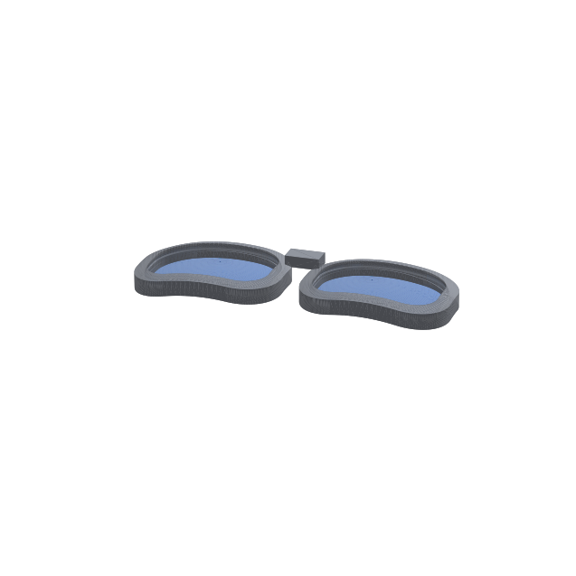

# glasses-3dp

A small parametric toolkit for designing **3D-printable eyeglass frames that snap-retain real lenses**. You give it a lens outline, a prescription, and a base curve; it builds a curved frame front with a proper retaining groove, plus matching left/right lens solids — exported as STL/STEP, ready to print on an SLA printer.



It's a *framework*, not a finished product: bring your own lens outlines (SVG) and tune the parameters to your lenses and face. The defaults produce a generic −2.00 D demo so you can see it work immediately.

---

## Why this exists

Salvaged or off-the-shelf lenses are spherical on the front (the **base curve**) and carry the prescription on the back. Their edge is ground to a **V-bevel** that seats into a groove in the frame. This toolkit models that geometry faithfully so you can *difference a real lens out of a frame blank* and get a part the lens snaps into — instead of guessing at a groove.

## What it models

- **Front base curve** — a sphere. Read it off a lens clock in diopters; the geometry uses `R(mm) = 530 / D` (the n=1.53 tooling convention), so the index-dependent diopter label doesn't matter.
- **Prescription (back) curve** — a second sphere; `back_diopters = base − Rx`. A meniscus lens with a thicker edge for a minus Rx.
- **V-bevel, front-surface tracked** — the bevel apex sits a *fixed* distance behind the front surface; the apex→back distance *varies* around the rim as the edge thickness changes (exactly how an edger rides the base curve). The lens bevel is therefore asymmetric.
- **Symmetric frame groove** — a fixed V channel (like a rolled/ground eyewire groove) that the asymmetric lens apex seats into, with a real retaining undercut.
- **Curved frame cross-section** — front *and* back faces follow the base curve (a curved shell), not a flat slab.
- **Pupillary distance** — the two lenses are placed at ±PD/2 about their **optical centers**, with decentration controlling the nose gap (`DBL = PD − lens_width + 2·decenter`). Because a pre-ground lens has a fixed optical center, you position the outline relative to it.

## Install

```bash
python -m venv .venv && source .venv/bin/activate
pip install -r requirements.txt   # build123d is the only hard dependency
```

Requires Python 3.11+ (developed on 3.12). `build123d` ships the OpenCASCADE kernel; the rest of `requirements.txt` is only for the render/preview helpers.

## Quick start

```bash
python frames.py
```

With no input SVG it uses a built-in parametric lens shape, writes a `sample_lens.svg` template, and produces:

| File | What it is |
|------|------------|
| `front.stl` | the printable frame front (both eyes + bridge, one solid) |
| `lens_right.stl`, `lens_left.stl` | the matching lens solids (for fit-checking / mock lenses) |
| `assembly.step` | everything together, for inspection in a CAD viewer |

Preview it without a CAD program:

```bash
python render_iso.py   # writes iso.png
```

## Single-eye test print

To validate the snap fit with one lens, generate a single rim instead of the full front:

```bash
python single_eye.py   # writes right_eye_frame.stl (+ right_eye_lens.stl)
```

It defaults to the bundled `examples/sample-lens.svg` (rotated to landscape, scaled to
55.5mm). Edit `INPUT_SVG` / `OUTLINE_ROTATE` / `OUTLINE_WIDTH_MM` at the top for your own
lens. The snap fit has been confirmed on an FDM print; SLA (stiffer, more brittle) may
need a looser `LENS_TOL` or shallower `BEVEL_PROTRUDE`.

## Using your own lens

1. **Trace the outline.** Flatbed-scan the lens (true 1:1 mm scale, no perspective), trace it to a single closed path, and export an **SVG in millimeters**.
2. **Find the optical center.** Shine a light through the lens and line up the front/back reflections; mark that point and measure its (x, y) in the SVG's coordinate frame.
3. **Measure the base curve** with a lens clock → `BASE_DIOPTERS`. Set your `PRESCRIPTION_SPH`.
4. Point the toolkit at your file:

```python
# in frames.py
INPUT_SVG      = "mylens.svg"
OPTICAL_CENTER = (x, y)   # mm, in the SVG frame; lands the optical axis correctly
```

## Key parameters

All live at the top of `frames.py`:

| Parameter | Meaning |
|-----------|---------|
| `PRESCRIPTION_SPH`, `BASE_DIOPTERS` | Rx sphere and chosen front base curve |
| `CENTER_THICK` | lens center thickness (mm) |
| `TRACK_DEPTH`, `BEVEL_PROTRUDE` | bevel apex depth behind front / radial protrusion |
| `GROOVE_ANGLE`, `GROOVE_CLEAR`, `GROOVE_TOL` | symmetric groove shape and fit clearance |
| `LENS_TOL` | lens↔frame clearance (snap fit) |
| `RIM_WIDTH`, `FRAME_THICK`, `LIP` | rim width, shell depth, lip overlap |
| `PD`, `DECENTER` | pupillary distance and optical-center decentration |
| bridge params | `BRIDGE_*` for the nose bridge bar |

## How it works

`frames.py` is a single readable script. The hard part — a V profile that follows the lens edge as a non-planar 3D ribbon — is built by sampling the **2D outline**, projecting onto the sphere analytically, and lofting explicit triangle profiles around the rim (OCCT's chamfer and closed-path sweep both choke on this geometry). The frame groove is the same construction; the frame is `blank − inset-lens-seat − groove`, then the front is bounded between two concentric base-curve spheres and the two eyes are mirrored and bridged into one solid.

## Status / roadmap

Working: lens + bevel, symmetric groove with retention, curved-shell two-eye front + bridge, SVG import, PD/decentration. **A test print is the only way to dial in the snap fit** for your resin.

Not done yet: hinge pockets for temples, bridge refinement (saddle/keyhole, nose-step blend), temples/arms.

## License

MIT — see [LICENSE](LICENSE).
